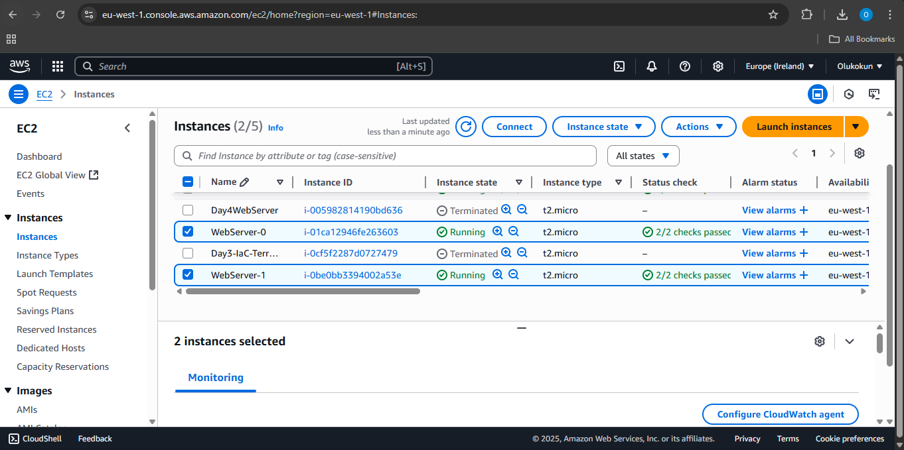
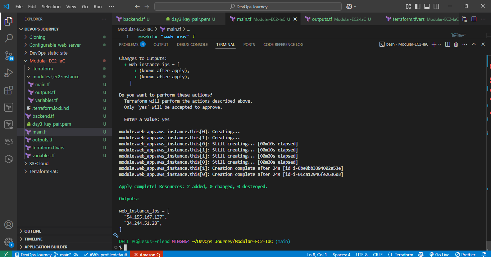
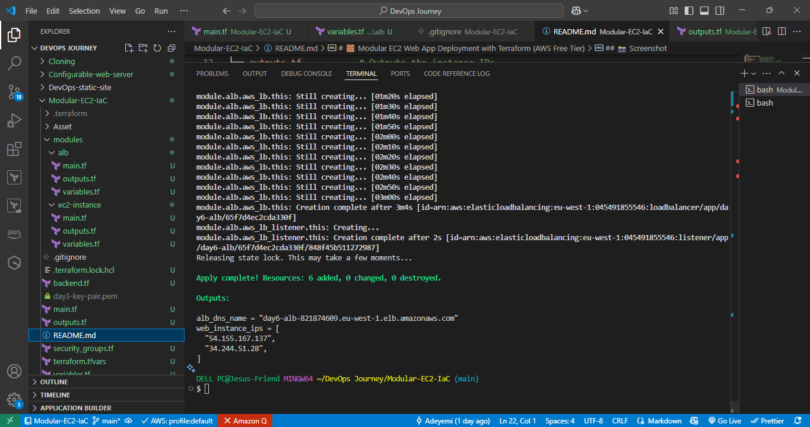

 # 🧱 Modular EC2 Web App Deployment with Terraform (AWS Free Tier)

> 🚀 A production-style, modular Infrastructure as Code (IaC) project built with **Terraform** and deployed on the **AWS Free Tier**. It features reusable modules, remote backend storage, secure state locking, and clustered EC2 web servers running **NGINX** automatically on boot.

---

## 🔧 Core Features

- 🧱 **Modular Architecture**: Clean separation using a reusable `ec2-instance` module inside `modules/`
- ⚙️ **Dynamic Configuration**: Inputs managed via `terraform.tfvars` (AMI ID, instance type, key pair, server count)
- 🌐 **Horizontal Scaling**: Uses `count` to deploy multiple EC2 instances at once
- 🔐 **Security Groups**: Custom inbound rules for HTTP (80) and SSH (22)
- 📤 **Public Outputs**: Auto-displays EC2 instance IPs for quick access
- 📦 **User Data Bootstrapping**: Installs **NGINX** on all instances at launch

---

## ✅ Project Highlights

- Provisions **multiple EC2 instances** using **Terraform modules**
- Stores remote Terraform state in **Amazon S3**
- Uses **DynamoDB** for **state locking and consistency**
- All compute runs on **AWS Free Tier (t2.micro in default VPC)**
- NGINX installed automatically using bash script in `user_data`
- Outputs public IPs of each instance after deployment

---

## 📌 Goals

- Build scalable, modular Terraform infrastructure from scratch
- Enforce clean configuration logic using variables and modules
- Apply real-world IaC practices like remote state and locking
- Stay fully compliant with AWS Free Tier limits

---

## 📸 Screenshots

| AWS EC2 Dashboard | VS Code Project Layout |
|-------------------|------------------------|
|  |  |
## 📸 Day 6 Screenshots
 
|  |


---

## 📁 Folder Structure

```bash
.
├── backend.tf               # Remote backend config (S3 + DynamoDB)
├── main.tf                  # Root Terraform file (calls EC2 module)
├── variables.tf             # Input variable declarations
├── terraform.tfvars         # Custom input values
├── outputs.tf               # Exports EC2 public IPs
├── security_groups.tf       # Security group rules
└── modules/
    └── ec2-instance/
        ├── main.tf
        ├── outputs.tf
        └── variables.tf
